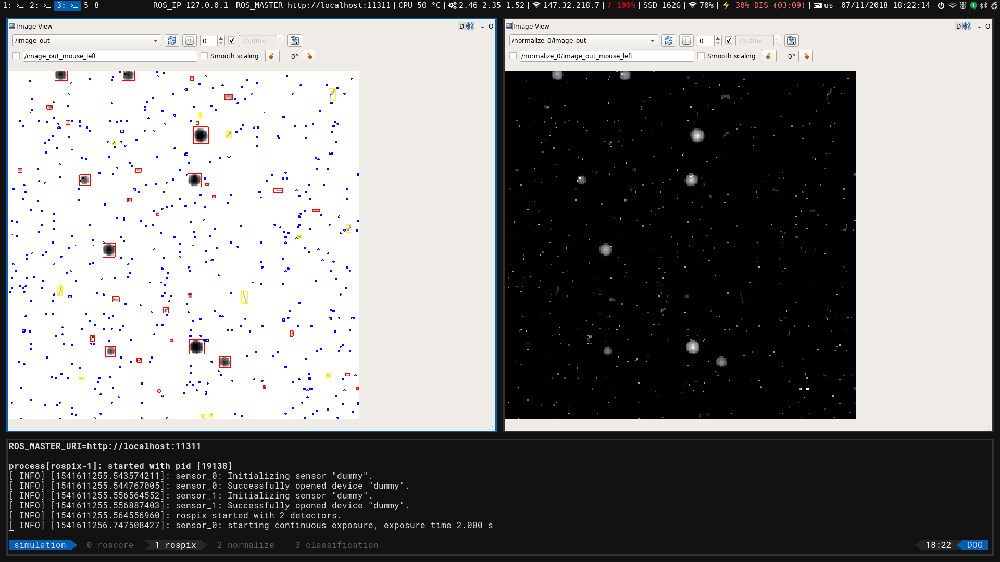

# Rospix Classification

A ROS node for basic morphologic track classification.



## Dependencies

To run the Python code, install the virtual environment by running:
```bash
./create_python_env.sh
```

## Real time classification

Coordinates of each cluster are relative to its top-left corner, the coordinates within the cluster are then relative to its position.

```bash
roslaunch classification real_time.launch
```
### Subscribed topics

The rospix output:
```
/track_classifier/image_in
```

### Published topics

The ROS image (possible to view using, e.g., rqt_image_view) showing labeled clusters:
```
/track_classifier/labeled_image
```

The classified data per each image:
```
/track_classifier/data
```

## Batch mode

In the batch mode, the ROS node takes CSV files in a given folder and processed them sequentially.
The node expects 1 image per input file, and the filenames in the format ``filenamename.extension``.

As results, it outputs two files per image, the 1st one containing overall image statistics, the 2nd one containing a cluster list.
Coordinates of each cluster are relative to its top-left corner, the coordinates within the cluster are then relative to its position.
The results, containing the statistics for each image and a list of clusters, are saved in JSON format.

The **input** and the **output** folders are set in the config file ```config/batch_processing.yaml```.

```yaml
# path will be relative to this package root folder
path_relative: True # use False if you plan on providing absolute filepaths
source_path: "datasets/in"
result_path: "datasets/out"
classifier_pipeline_path: "pipelines/vzlusat-1.joblib"

# delimiter for data on the input
input_delimiter: ','
```

To run the batch processing, issue the command:
```bash
roslaunch classification batch.launch
```

## References
1. T. Baca, D. Turecek, R. McEntaffer and R. Filgas, **[Rospix: Modular Software Tool for Automated Data Acquisitions of Timepix Detectors on Robot Operating System](http://stacks.iop.org/1748-0221/13/i=11/a=C11008)**, _Journal of Instrumentation_ 13(11):C11008, 2018.
2. M. Jilek, **[Processing of Radiation Data from the Timepix Sensor on the VZLUSAT-1 Satellite](https://dspace.cvut.cz/bitstream/handle/10467/77036/F3-DP-2018-Jilek-Martin-thesis.pdf)**, Master's thesis, Czech Technical University in Prague, Faculty of Electrical Engineering, 2018.
3. T. Baca, M. Jilek, I. Vertat, M. Urban, O. Nentvich, R. Filgas, C. Granja, A. Inneman and V. Daniel **[Timepix in LEO Orbit onboard the VZLUSAT-1 Nanosatellite: 1-year of Space Radiation Dosimetry Measurements](http://stacks.iop.org/1748-0221/13/i=11/a=C11010)**, _Journal of Instrumentation_ 13(11):C11010, 2018.

# Acknowledgements

The work has been done on behalf of Medipix2 collaboration and is currently supported by the Czech Science Foundation project 18-10088Y and by Czech Technical University grant no. SGS17/187/OHK3/3T/13.
